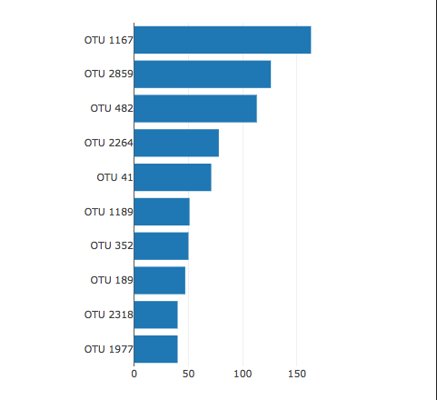
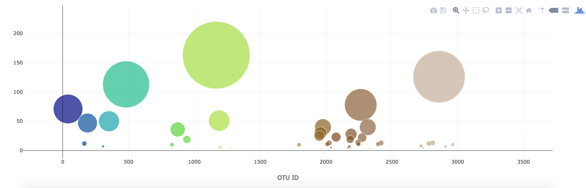
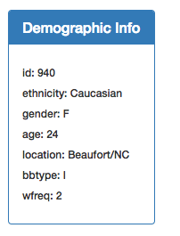
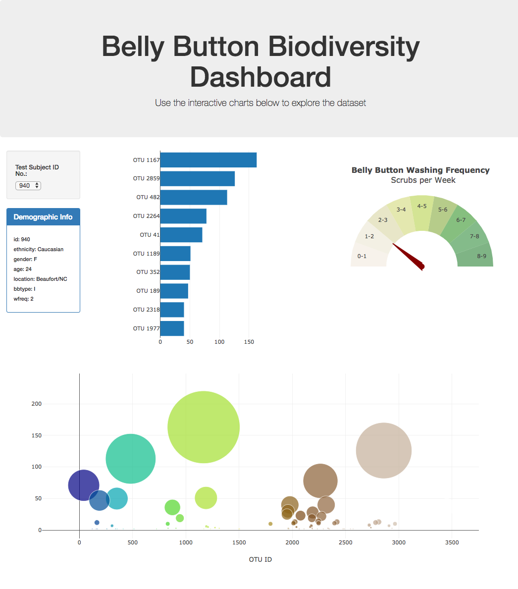
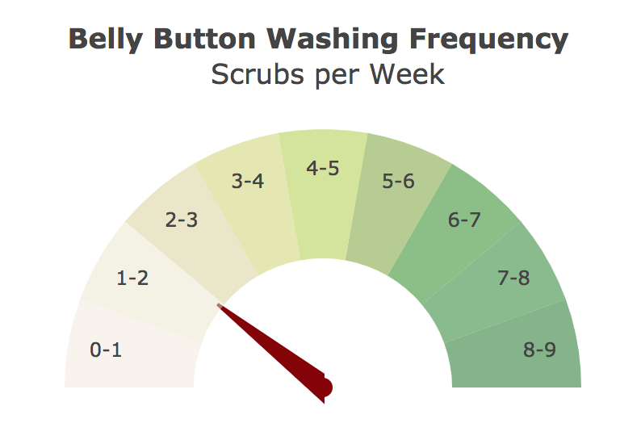

**Deployment**
Here is a link to the dashboard :  https://rajeshwariradhakrishna.github.io/belly-button-challenge/

**Background**
In this assignment, you will build an interactive dashboard to explore the Belly Button Biodiversity dataset, which catalogs the microbes that colonize human navels.

The dataset reveals that a small handful of microbial species (also called operational taxonomic units, or OTUs, in the study) were present in more than 70% of people, while the rest were relatively rare.

**Instructions**    
Complete the following steps:

1. Use the D3 library to read in samples.json from the URL https://2u-data-curriculum-team.s3.amazonaws.com/dataviz-classroom/v1.1/14-Interactive-Web-Visualizations/02-Homework/samples.json.

2. Create a horizontal bar chart with a dropdown menu to display the top 10 OTUs found in that individual.
    1. Use sample_values as the values for the bar chart.
    2. Use otu_ids as the labels for the bar chart.
    3. Use otu_labels as the hovertext

3. Create a bubble chart that displays each sample.

    1. Use otu_ids for the x values.

    2. Use sample_values for the y values.

    3. Use sample_values for the marker size.

    4. Use otu_ids for the marker colors.

    5. Use otu_labels for the text values.

4. Display the sample metadata, i.e., an individual's demographic information.

5. Display each key-value pair from the metadata JSON object somewhere on the page.

6. Update all the plots when a new sample is selected. Additionally, you are welcome to create any layout that you would like for your dashboard. An example dashboard is shown as follows:

7. Deploy your app to a free static page hosting service, such as GitHub Pages. Submit the links to your deployment and your GitHub repo. Ensure that your repository has regular commits and a thorough README.md file.

